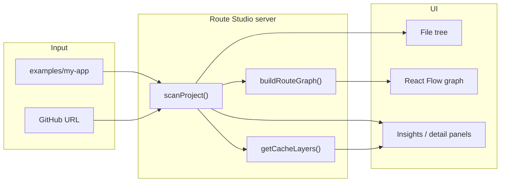

# Route Studio

**Google Maps for your Next.js `app/` folder.**

Route Studio is an open-source visual explorer for **Next.js App Router** projects. Point it at a repo (or use the bundled demo), and it turns the `app/` directory into an interactive route graph with plain-English insights about rendering, React Server Components, and caching.

Built with **Next.js 16**, **React Flow**, and **TypeScript** — aligned with the Vercel / Next.js ecosystem.

---

## Table of contents

- [Why Route Studio exists](#why-route-studio-exists)
- [Features](#features)
- [Screens & URLs](#screens--urls)
- [Quick start](#quick-start)
- [How it works](#how-it-works)
- [Bundled demo app](#bundled-demo-app)
- [GitHub import](#github-import)
- [Environment variables](#environment-variables)
- [Project structure](#project-structure)
- [Analyzer](#analyzer)
- [Data model](#data-model)
- [API routes](#api-routes)
- [Deploy to Vercel](#deploy-to-vercel)
- [Open source & contributing](#open-source--contributing)
- [Roadmap](#roadmap)
- [License](#license)

---

## Why Route Studio exists

The App Router organizes routes as **folders** under `app/`:

```
app/
  layout.tsx
  dashboard/
    layout.tsx
    page.tsx
    loading.tsx
    settings/
      page.tsx
  (auth)/
    login/page.tsx
  api/
    health/route.ts
```

That structure is powerful but hard to mental-model — especially with route groups `(auth)`, dynamic segments `[id]`, parallel routes, nested layouts, and four separate cache layers.

Route Studio answers:

| Question | Where in the UI |
|----------|-----------------|
| What routes exist? | File tree + route graph |
| How do layouts wrap pages? | React Flow graph (purple layout edges) |
| Is this route static or dynamic? | Route insights panel / route detail |
| Why isn't the Data Cache used? | Cache layers + suggested `fetch()` fix |
| Where is the client boundary? | Request flow diagram |

**Differentiator vs [nextmap](https://github.com/icydotdev/nextmap) / [troql](https://github.com/yashkr321/troql):** same route graph idea, plus **fresher-friendly cache autopsy**, suggested fixes, and FAQ answers derived from scan signals — in one web UI.

---

## Features

### Static analyzer (no code execution)

- Walks `app/` or `src/app/` on disk (or downloads from GitHub)
- Detects special files: `page`, `layout`, `loading`, `error`, `route`, etc.
- Parses route segments: static, `[dynamic]`, `[...catch-all]`, `(route-groups)`, `@parallel`
- Reads source for `"use client"`, `export const dynamic`, `revalidate`, `fetch` cache options, `cookies()` / `headers()`
- Detects `proxy.ts` / `middleware.ts` at project root

### Dashboard

| Panel | Purpose |
|-------|---------|
| **File tree** | Browse real `app/` structure; click to select |
| **Route graph** | Interactive React Flow canvas — zoom, pan, fit-to-view, fullscreen, PNG/SVG export |
| **Route insights** | Quick cards: Rendering, Cache strategy, Data cache, docs link |
| **Upload folder** | Drag & drop or pick a local project folder |
| **GitHub import** | Paste a public repo URL; monorepo subfolder suggestions on error |
| **Share** | Copy a link to this analysis (~1 hour TTL) |
| **Theme** | Light / dark toggle |

### Route detail

Deep dive on one URL (example: `/dashboard/settings`):

| Section | Purpose |
|---------|---------|
| **Metadata sidebar** | Runtime, rendering mode, segment config, revalidate |
| **Caching layers** | All four Next.js cache layers with ✓ / ✕ status |
| **Request flow** | Browser → Proxy → Layout → Page → Client boundary |
| **Suggested fetch()** | Copy-paste snippet to enable caching |
| **Ask about this route** | Chat about caching and performance — OpenAI when configured, local analysis otherwise |

---

## Screens & URLs

| URL | Screen |
|-----|--------|
| `/` | Product landing page |
| `/studio` | Dashboard — file tree + graph + insights |
| `/studio/route/dashboard/settings` | Route detail example (dynamic + no-store) |
| `/studio/route/[...segments]` | Route detail for any scanned route |
| `/scan` | Raw analyzer debug UI + JSON |
| `/api/scan` | JSON API — bundled demo project |
| `/api/import/github` | POST `{ "url": "..." }` — import public GitHub repo |

**Left nav (studio pages):**

| Icon | Destination |
|------|-------------|
| ⌂ | Home |
| ▤ | Dashboard (`/studio`) |
| ⚙ | Route detail example (`/studio/route/dashboard/settings`) |
| `{ }` | Scan debug (`/scan`) |

---

## Quick start

```bash
cd route-studio/web
npm install
npm run dev
```

Open **http://localhost:3000** → click **Explore demo project** or go directly to **http://localhost:3000/studio**.

Production build:

```bash
npm run build
npm start
```

---

## How it works

Route Studio **never runs your target app**. It only reads files and applies heuristics.



1. **Scan** — `scanProject(rootPath)` walks the filesystem, builds a file tree, and collects `RouteSegment[]`.
2. **Graph** — `buildRouteGraph(project)` maps layouts → pages → API routes into React Flow nodes and edges.
3. **Insights** — per-route heuristics from `analyzeSource()` and `getCacheLayers()`.
4. **Render** — React client components display the dashboard and route detail pages.

---

## Bundled demo app

The demo lives at `web/examples/my-app/` (also mirrored at `examples/my-app/` for local monorepo layout).

| Route | URL | Concepts demonstrated |
|-------|-----|------------------------|
| Home | `/` | Root layout + page |
| Dashboard | `/dashboard` | Nested layout, `loading.tsx` |
| Settings | `/dashboard/settings` | `force-dynamic`, `fetch` + `no-store`, client component |
| Login | `/login` | Route group `(auth)` — omitted from URL |
| Register | `/register` | Route group `(auth)` |
| Health API | `/api/health` | Route handler (`route.ts`) |
| Proxy | — | `proxy.ts` (Next.js 16; formerly middleware) |

The dashboard pre-selects **`/dashboard/settings`** because it best showcases dynamic rendering and a Data Cache miss.

---

## GitHub import

From the dashboard, click **Import from GitHub** and paste a URL:

```
https://github.com/vercel/next.js/tree/canary/examples/hello-world
```

**Supported URL shapes:**

- `https://github.com/owner/repo`
- `https://github.com/owner/repo/tree/branch`
- `https://github.com/owner/repo/tree/branch/path/to/app`

**Monorepos:** if the repo root has no `app/` folder, Route Studio suggests subfolders (prefers `examples/` and `apps/`).

**Limits:**

- Public repos only (unless `GITHUB_TOKEN` is set)
- Max ~400 files, 512 KB per file
- Server-side cache: 5 minutes per URL

**Common mistake:** importing `vercel/next.js` at the repo root fails — use a subfolder like `examples/hello-world`.

---

## Local folder upload

From the dashboard, click **Upload folder** and drag a project directory or use the folder picker.

- Scans `app/` or `src/app/` — same limits as GitHub import (~400 files, 512 KB each)
- Files are written to a temp directory server-side, then analyzed statically
- Nothing is executed

---

## Environment variables

Create `web/.env.local` (optional):

| Variable | Purpose |
|----------|---------|
| `GITHUB_TOKEN` | GitHub PAT — higher rate limits + private repo access |
| `OPENAI_API_KEY` | Enables OpenAI-powered route chat (optional) |

---

## Project structure

```
route-studio/
├── README.md                 ← You are here
├── web/                      ← Next.js app (deploy this folder)
│   ├── app/                  ← App Router pages & API routes
│   │   ├── page.tsx          ← Landing
│   │   ├── studio/           ← Dashboard
│   │   ├── scan/             ← Debug UI
│   │   └── api/
│   │       ├── scan/         ← GET demo project JSON
│   │       └── import/github/
│   ├── components/
│   │   ├── dashboard/        ← Shell, graph, tree, insights, import dialog
│   │   ├── route-detail/     ← Metadata, flow, fetch, FAQ panels
│   │   └── layout/           ← Studio icon nav
│   ├── lib/
│   │   ├── analyzer/         ← Static scanner (core engine)
│   │   ├── graph/            ← React Flow node/edge builder
│   │   ├── github/           ← URL parse, download, monorepo discovery
│   │   ├── route-detail/     ← Cache layers, FAQ, suggested fetch
│   │   ├── demo-routes.ts    ← Demo route constants
│   │   └── example-project.ts
│   ├── examples/my-app/      ← Bundled demo (Vercel-safe path)
│   └── vercel.json
├── examples/my-app/          ← Same demo (local dev fallback)
```

See also [`web/README.md`](./web/README.md) for developer-focused notes.

---

## Analyzer

Entry point: `scanProject(rootPath)` in `web/lib/analyzer/`.

| Module | Role |
|--------|------|
| `scan-project.ts` | Main scanner — tree walk + route collection |
| `segments.ts` | Parse `(groups)`, `[id]`, `[...slug]`, `@slot` |
| `analyze-file.ts` | Regex heuristics on file source |
| `types.ts` | `RouteProject`, `RouteSegment`, `FileTreeNode` |

**What it detects in source files:**

- `"use client"` → client component boundary
- `export const dynamic = 'force-dynamic' | 'force-static'`
- `export const revalidate = N | false`
- `fetch(..., { cache: 'no-store' })` and `next: { revalidate }`
- `cookies()`, `headers()` → dynamic rendering signals
- `export const runtime = 'edge'`

**What it does not do (yet):**

- Run TypeScript compiler / AST analysis
- Execute the target application
- Detect every edge case in the App Router spec

Debug the analyzer at **http://localhost:3000/scan** or `GET /api/scan`.

---

## Data model

```ts
type RouteProject = {
  name: string;
  rootPath: string;
  appDir: string;              // "app" or "src/app"
  nextVersion: string | null;
  proxy: ProxyInfo | null;
  tree: FileTreeNode[];
  routes: RouteSegment[];
  github?: GitHubSource;
};

type RouteSegment = {
  id: string;                  // "dashboard/settings" (segment id)
  urlPath: string;             // "/dashboard/settings" (public URL)
  segmentPath: string;
  segments: ParsedSegment[];
  files: RouteFile[];
  rendering: "static" | "dynamic" | "unknown";
  revalidate: number | null;
  runtime: "nodejs" | "edge" | "auto";
  isRSC: boolean;
  hasClientBoundary: boolean;
  cacheNotes: string[];        // human-readable signals
};
```

Route detail URLs use segment IDs: `/studio/route/dashboard/settings` maps to `id: "dashboard/settings"`.

---

## API routes

### `GET /api/scan`

Returns the bundled `examples/my-app` project as JSON.

```bash
curl http://localhost:3000/api/scan | jq '.routes[].urlPath'
```

### `POST /api/import/github`

```bash
curl -X POST http://localhost:3000/api/import/github \
  -H 'Content-Type: application/json' \
  -d '{"url":"https://github.com/vercel/next.js/tree/canary/examples/hello-world"}'
```

**Success:** `{ ok: true, project: RouteProject, repoUrl: string }`

**Error (monorepo):** `{ ok: false, error: string, suggestions: string[] }`

---

## Deploy to Vercel

1. Push this repo to GitHub.
2. Import in [Vercel](https://vercel.com/new).
3. Set **Root Directory** to `web`.
4. Deploy.

The demo app is bundled inside `web/examples/my-app` — no external dependencies at runtime.

Optional: add `GITHUB_TOKEN` in Vercel project settings for GitHub import rate limits.

---

## Open source & contributing

Route Studio is **MIT licensed** — see [LICENSE](./LICENSE).

| File | Purpose |
|------|---------|
| [CONTRIBUTING.md](./CONTRIBUTING.md) | How to fork, PR, and local checks |
| [.github/CODEOWNERS](./.github/CODEOWNERS) | Requires maintainer review on every PR |
| [.github/workflows/ci.yml](./.github/workflows/ci.yml) | Lint + build on every PR |

**`main` is protected:** contributors open pull requests; only the code owner can approve and merge. Direct pushes to `main` are blocked for everyone else.

### First-time publish to GitHub

```bash
cd route-studio

# 1. Replace YOUR_GITHUB_USERNAME in .github/CODEOWNERS with your handle

git init
git add .
git commit -m "Initial commit: Route Studio open source"
gh repo create route-studio --public --source=. --remote=origin --push

# 2. Lock down main (only you can merge)
chmod +x scripts/setup-branch-protection.sh
./scripts/setup-branch-protection.sh YOUR_GITHUB_USERNAME route-studio YOUR_GITHUB_USERNAME
```

---

## Roadmap

| Status | Item |
|--------|------|
| ✅ Done | Analyzer, dashboard, route detail, bundled demo, GitHub import |
| ✅ Done | Upload local folder (drag & drop) |
| ✅ Done | AI “Ask about this route” (real chat, not FAQ) |
| ✅ Done | Export graph as SVG / PNG |
| ✅ Done | Share link to route analysis |
| ✅ Done | Theme toggle |

---

## License

MIT
